# Профилирование и анализ добавления параллельности и шардирования
## Ошибки, которые я допустил при профилировании
### Проверять на пустом сервере. 
## Рубрика "Интересные факты"
### 10000rpc на put на протяжение 20 секунд, 1 тред, и мнооого connection'ов...
1 connection (не завелось)
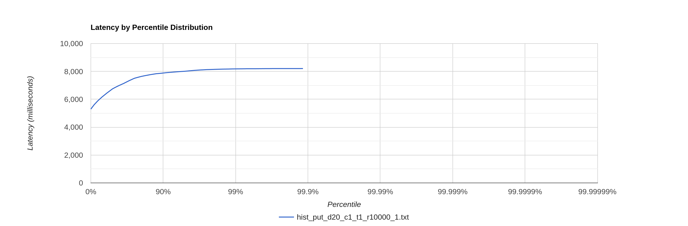
2 connection (завелось половину)
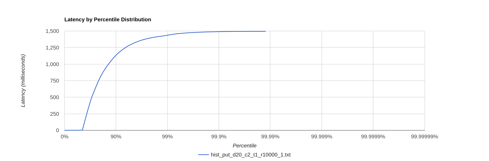
3 connection (завелось)
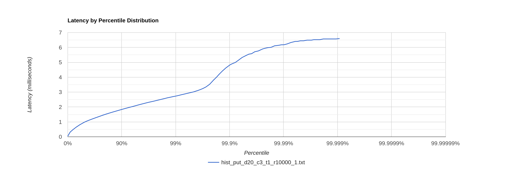
5 connection
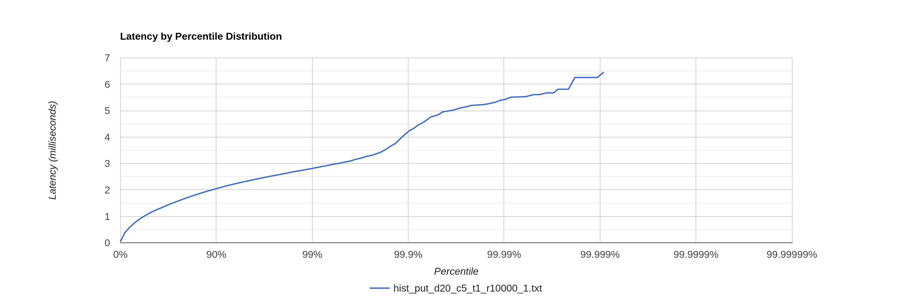
30 connection
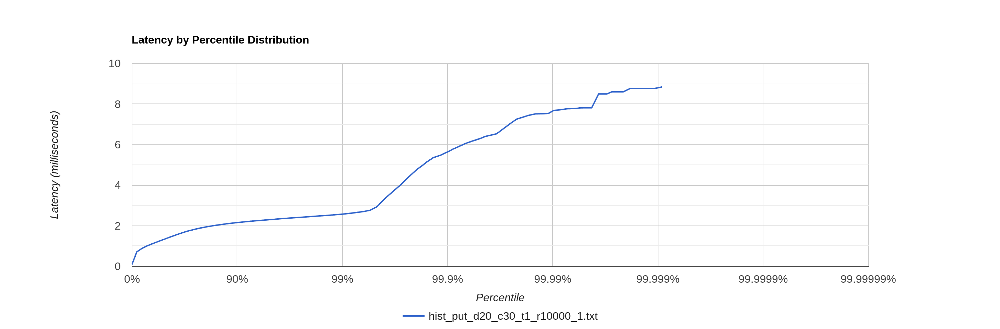
100 connection (оптимально, берём на следующие профайлы, также замерил аллокации)

cpu
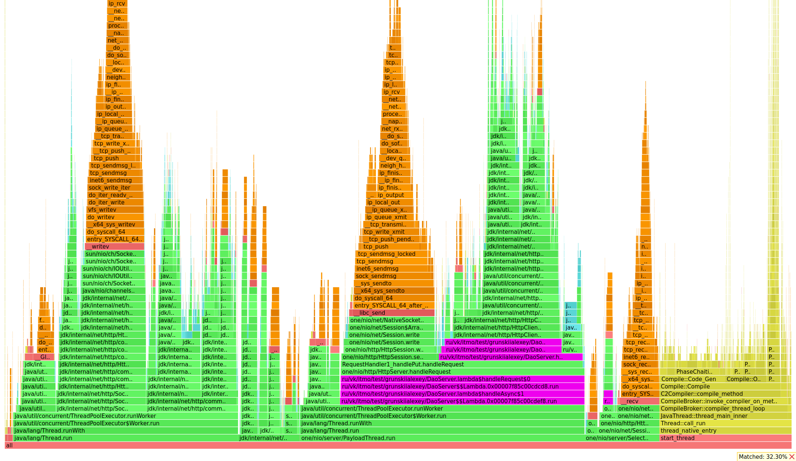
alloc
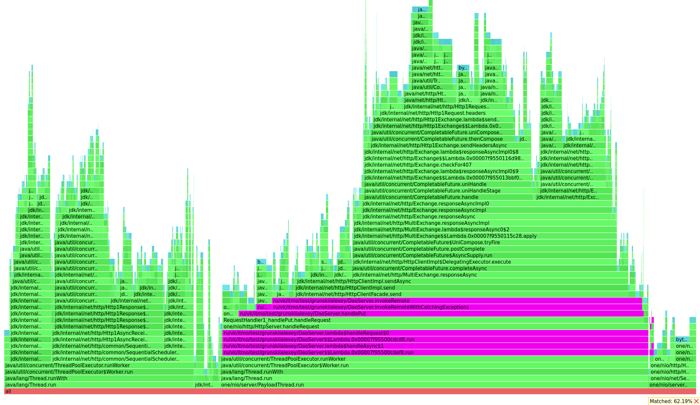
500 connection
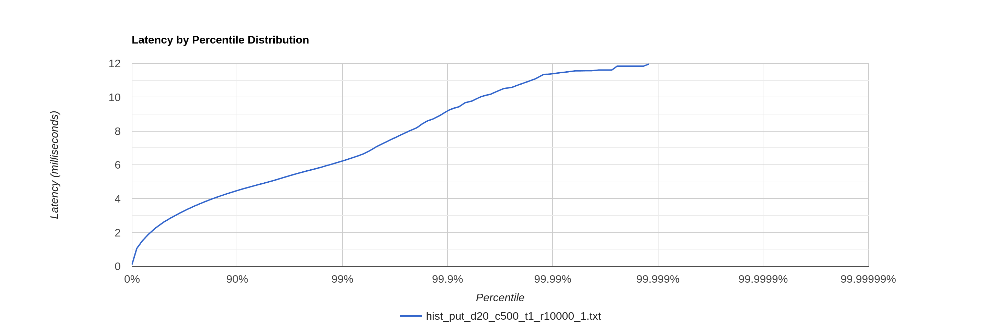
2500 connection
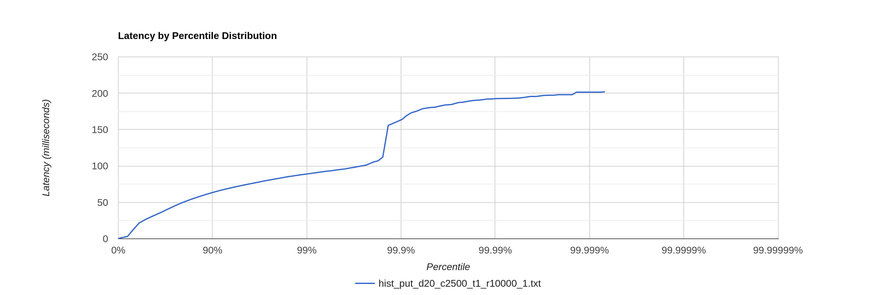
10000 connection
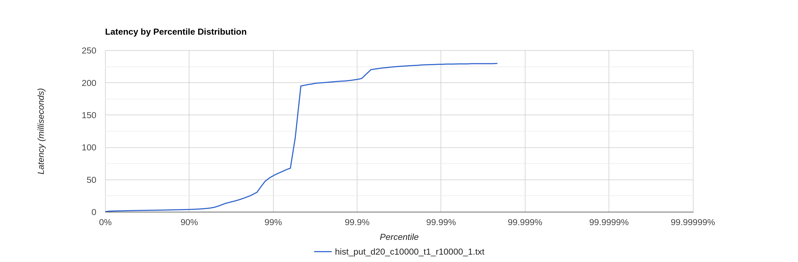
###  А теперь сделаем несколько тредов
1 threads (кол-во созданный файлов с индексацией в каждом шарде - 11)
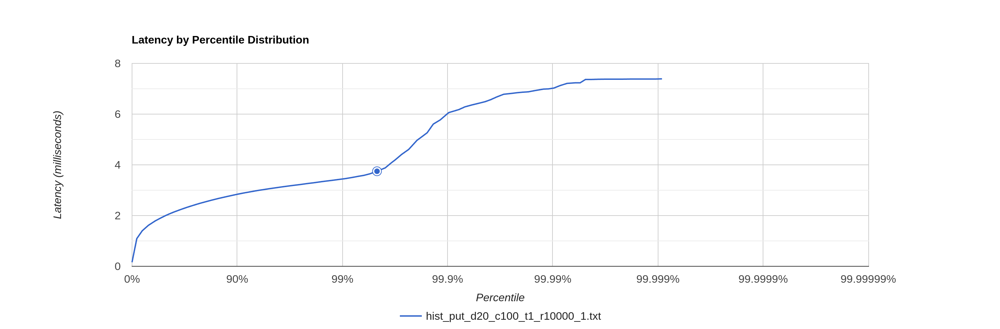
2 threads (кол-во созданный файлов с индексацией в каждом шарде - 5)
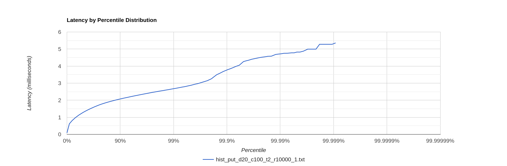
3 threads (кол-во созданный файлов с индексацией в каждом шарде - 3-4). <- профайлинг alloc и cpu, lock возьмём по этой истории
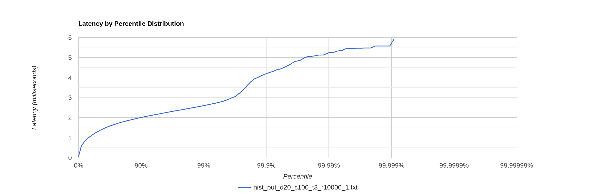
cpu
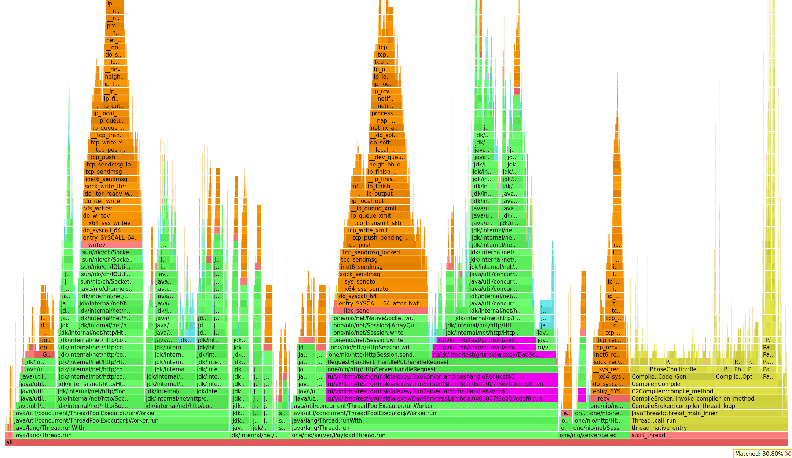
alloc
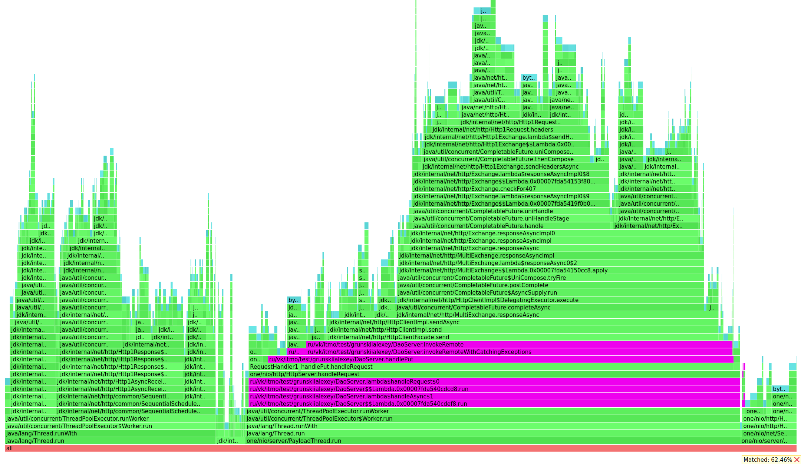
lock
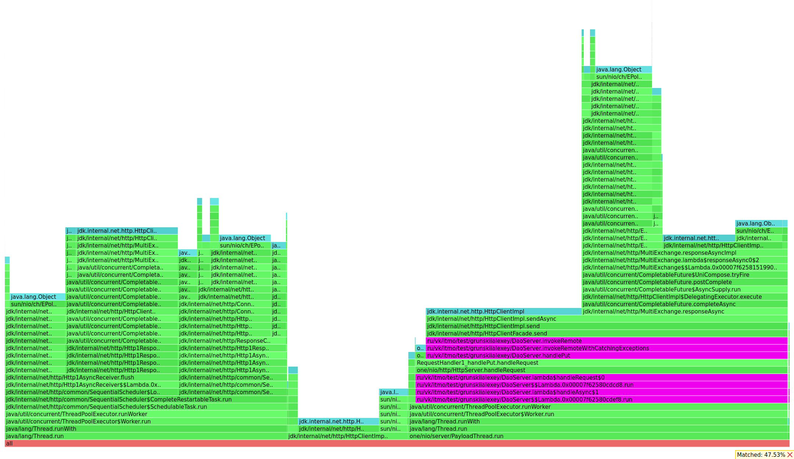
4 threads (кол-во созданный файлов с индексацией в каждом шарде - 2)
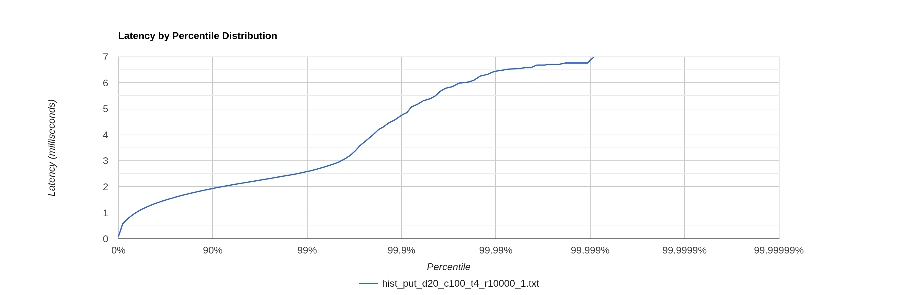
5 threads (кол-во созданный файлов с индексацией в каждом шарде - 1)
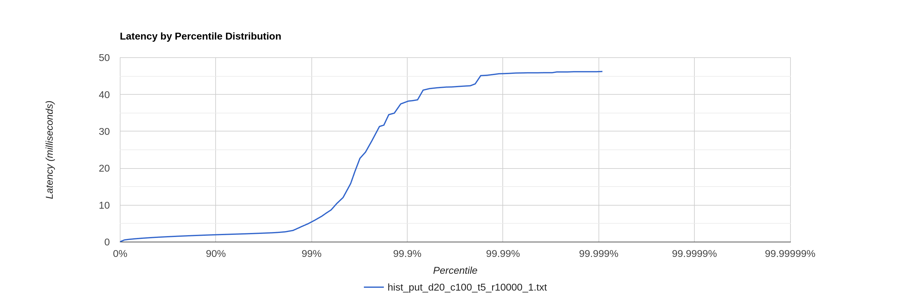
6 threads (кол-во созданный файлов с индексацией в каждом шарде - 1)
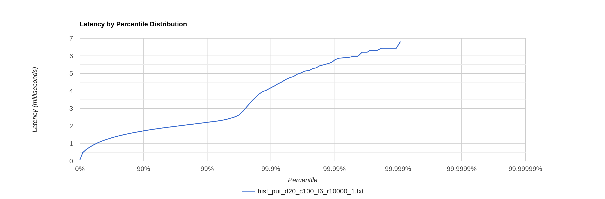
10 threads (кол-во созданный файлов с индексацией в каждом шарде - 1-0)
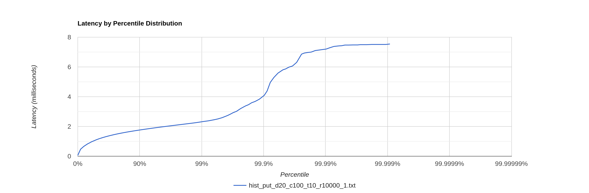
13 threads (кол-во созданный файлов с индексацией в каждом шарде - 0)
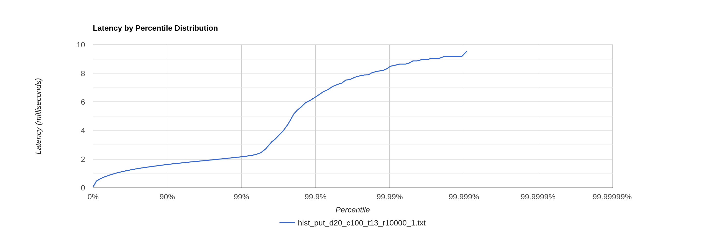
100 threads (кол-во созданный файлов с индексацией в каждом шарде - 0)
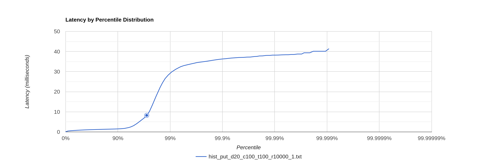
### Я наполнил базу ~400 файлами и теперь можно приступать к нагрузкам на чтение :)
